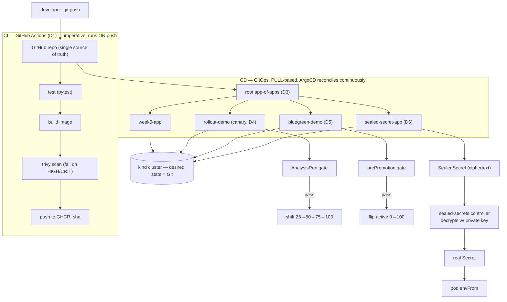

# Week 5 Capstone — CI/CD + GitOps end to end

A one-page synthesis of the week: how a commit becomes a running, progressively
delivered, secret-consuming app **without anyone running `kubectl apply`** — Git is
the only control surface. Built hands-on on a `kind` cluster with ArgoCD + Argo
Rollouts + sealed-secrets. Personal GitHub + GHCR only ($0, no AWS).

---

## 1. The whole flow (one picture)



**The one idea that ties it together:** CI is **push-based and imperative** (it runs
*because* you pushed). CD is **pull-based and declarative** (ArgoCD continuously makes
the cluster match Git, whether or not anything just happened). CI ends by updating
Git; CD begins by watching Git. **Git is the seam between them.**

---

## 2. CI — build → test → scan → push (D1)

`.github/workflows/week5-ci.yml` (lives at **repo root** — GitHub only runs it there):

| Stage | Gate | Why it's ordered this way |
|---|---|---|
| `test` (pytest) | nothing builds if tests fail | cheapest check first |
| `build` | image tagged with `github.sha` | traceability commit→image |
| `scan` (trivy) | fail on HIGH/CRITICAL | **scan before push** — never publish unvetted |
| `push` (GHCR) | only on `main` | feature branches don't ship |

- **Least privilege:** `permissions: contents:read, packages:write` — the workflow
  can read code and push a package, nothing more.
- **Traceability:** the running container reports the same version via `APP_VERSION`,
  so "what's live" maps back to a commit.

---

## 3. GitOps CD — ArgoCD (D2) and app-of-apps (D3)

### Push vs pull deployment
| | Push CD (Jenkins `kubectl apply`) | Pull CD (GitOps / ArgoCD) |
|---|---|---|
| Who acts | CI reaches **into** the cluster with creds | agent **inside** the cluster pulls from Git |
| Drift | undetected until it breaks | **selfHeal** reverts it continuously |
| Audit | scattered in CI logs | the Git history **is** the audit log |
| Rollback | re-run a job | `git revert` |

**Proven live:** `kubectl scale --replicas=5` was reverted to the Git value (2) within
~30s by **selfHeal**; a bug fix pushed to Git rolled out with zero `kubectl`.

### App-of-apps (D3)
One **root** Application whose Git source is a *folder of child Application manifests*
(`gitops/apps/`). Onboard an app = drop a YAML + push; ArgoCD creates the whole thing,
zero `kubectl`. **Big gotcha learned:** deleting an ArgoCD Application does **not**
cascade-delete its workload by default — it **orphans** it. Fix = the
`resources-finalizer.argocd.argoproj.io` finalizer on every child app (needed at both
levels: root→children and child→workload).

---

## 4. Progressive delivery — canary (D4) vs blue-green (D5)

Both replace the default "all-at-once" rolling update with a **metric-gated** release
driven by an `AnalysisTemplate` (here a web probe of the new pods' reported version;
in prod it'd be a Prometheus success-rate / latency query).

| | Canary (D4) | Blue-green (D5) |
|---|---|---|
| Traffic shift | gradual 25→50→75→100 | instant 0→100 flip |
| Pods mid-rollout | mostly old + a few new | **two full stacks** side by side |
| Test before cutover | only via canary weight | **yes — dedicated preview Service** |
| Cost | low | ~2× replicas briefly |
| Gate | `analysis` step between weights | `prePromotionAnalysis` before the flip |

- **Canary demo:** good version auto-promoted through every weight; a `broken` version
  failed the gate → `RolloutAborted`, stable kept 100%.
- **Blue-green demo:** good version passed the pre-promotion gate → active flipped in
  one step; `broken` failed → **the flip never happened**, blue kept serving. Proved
  isolation mid-preview: `active` returned v1 and `preview` returned v2 *at the same
  instant* via two port-forwards.
- **`postPromotionAnalysis`** is the complement — runs *after* the flip and auto-rolls
  `active` back if the new version misbehaves under real traffic.

**Key gotcha (D4):** a *good* canary once false-aborted because the gate probed the
canary Service before its pods passed the startupProbe (connection refused = a failed
sample, and `failureLimit: 0` aborted on that single blip). Fix = `initialDelay`
(warm-up) + `failureLimit > 0`. **An analysis gate must wait for Ready and tolerate
transient noise, or it auto-aborts healthy releases on timing.**

---

## 5. GitOps secrets — sealed-secrets (D6)

The contradiction: GitOps says *"everything in Git"*; security says *"never commit a
plaintext secret."* A plain k8s `Secret` is only **base64** (reversible), so committing
one — especially to a public repo — is publishing the password.

**Resolution = asymmetric crypto.** The controller holds a key pair; the **private key
never leaves the cluster**. `kubeseal` fetches the **public** key and encrypts a Secret
into a `SealedSecret` (opaque ciphertext, safe for Git). ArgoCD syncs the `SealedSecret`
→ the controller decrypts it **in-cluster** into a real `Secret` → the pod consumes it
via `envFrom`. The seal is cryptographically **bound to namespace + name**, so it can't
be copied elsewhere to unseal.

```
plain Secret (--dry-run, in memory) → kubeseal (public key) → SealedSecret (git) →
ArgoCD → controller (private key) → real Secret → pod envFrom
```

**Proven:** `printenv API_KEY` in a running pod returned the original value, while
base64-decoding the committed ciphertext returned garbage. **Rotation gotcha:** the
key lives only in the cluster — recreate `kind` and old SealedSecrets are undecryptable;
real setups back up the controller's sealing key.

> **sealed-secrets vs external-secrets:** sealed-secrets *encrypts and commits* the
> value (self-contained, no external system). external-secrets commits only a
> *reference* and pulls the value from AWS Secrets Manager / Vault at runtime. Chose
> sealed-secrets for the $0, no-cloud lab; external-secrets is the pick when a secrets
> manager already exists and you want central rotation.

---

## 6. Interview one-liners
- *"CI is push-based and imperative, CD is pull-based and declarative; Git is the seam
  — CI ends by updating Git, ArgoCD begins by reconciling to it."*
- *"GitOps = the cluster continuously converges to Git; drift is auto-reverted by
  selfHeal and the Git history is the audit log — rollback is `git revert`."*
- *"App-of-apps: one root Application points at a folder of child apps, so onboarding is
  a YAML + push; deleting an Application doesn't delete its workload unless you add the
  resources-finalizer."*
- *"Canary shifts traffic gradually; blue-green stands up two full stacks and flips
  instantly with a preview Service you can test before any user hits it — both gated by
  an AnalysisRun."*
- *"An analysis gate must wait for the new pods to be Ready and tolerate transient noise,
  or a startup blip auto-aborts a healthy release."*
- *"Never commit a plaintext Secret — base64 isn't encryption. Sealed-secrets encrypts
  with a public key so only the in-cluster private key can decrypt; the ciphertext is
  safe even in a public repo."*

---

## Artifacts this week
`.github/workflows/week5-ci.yml` (CI) · `deploy/` (week5-app) · `gitops/root-app.yaml` +
`gitops/apps/*` (app-of-apps) · `rollout/` (canary Rollout + services + AnalysisTemplate)
· `bluegreen/` (blue-green Rollout + active/preview services + AnalysisTemplate) ·
`secrets/sealed-secret.yaml` (SealedSecret) — all delivered through GitOps, proven live
on `kind`.
